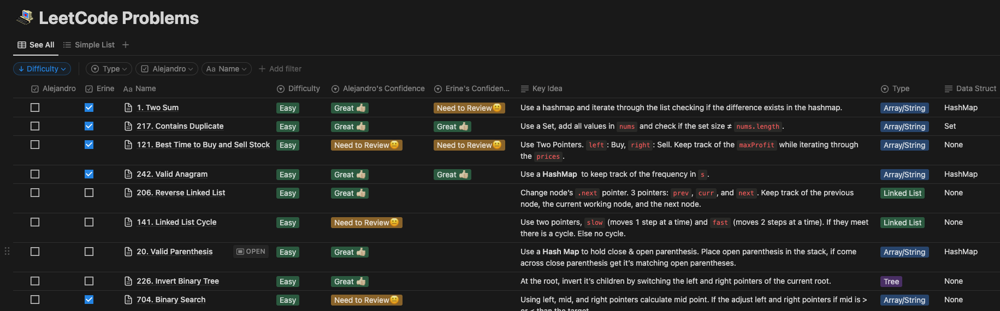
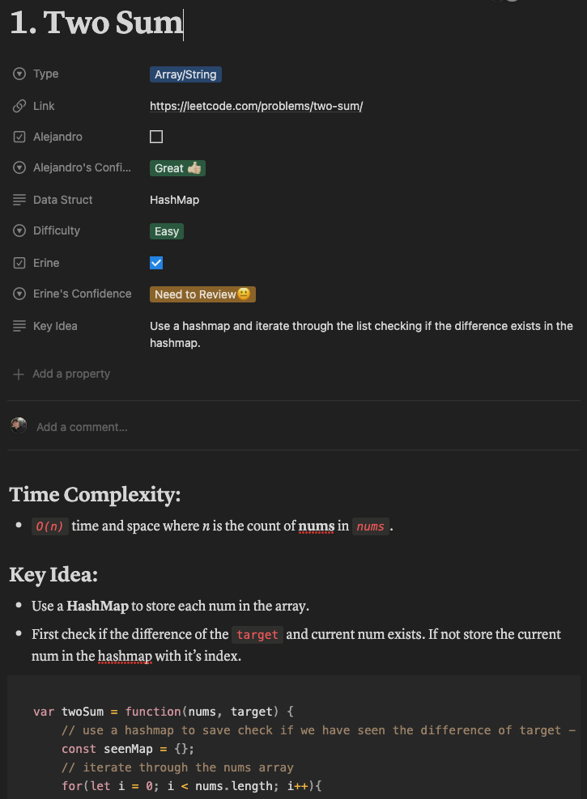

# LeetCode-Questions
Welcome to this repository!

Here, you will find a collection of solved LeetCode questions, organized by data structure to make it easy to find the specific type of problem you are looking for.

Within each data structure folder, you will find subfolders categorized by coding pattern. This makes it easy to identify and practice specific approaches to solving problems.

# Notion Page Sheet
If you'd like to view my notes on LeetCode questions I have solved and tips I noted for
solving them check out my public notion page.

[LeetCode Notion Page](https://irradiated-divan-178.notion.site/f1189912deab4d8eb5bd0a2ac0736388?v=81465bdacac24e5d9f681c50bf6f074d)

Sheet Preview:


Each question has documented tips and the solution posted:


# Running a JavaScript File Using Node.js
1. Open a terminal window and navigate to the directory containing the `.js` file you want to run.

2. Type the following command to run the `.js` file using Node.js:
```javascript
node filename.js
```
Replace `filename` with the actual name of the `.js` file you want to run.

3. Press enter to execute the command. The output of the script will be displayed in the terminal window.

For example, if you want to run a file called `twoSum.js` located in the `Arrays` folder, you would navigate to the `Arrays` folder in your terminal and type the following command:

```javascript
node twoSum.js
```
This would run the `twoSum.js` file using Node.js and display the output in the terminal window.